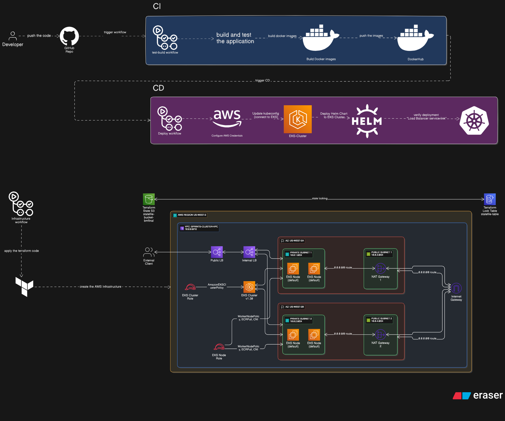

# BM-Graduation-Project: 3-Tier Web Application

A complete 3-tier web application built with Python Flask and deployed on AWS EKS using modern DevOps practices including Docker, Kubernetes, Helm, Terraform, and CI/CD pipelines.

## 🏗️ Architecture Overview

This application follows a 3-tier architecture pattern:

1. **Frontend Layer (app/)** - User interface built with Flask
2. **API Layer (api/)** - Backend services and business logic  
3. **Database Layer (db/)** - MySQL database for data persistence

The application is containerized, orchestrated with Kubernetes, and deployed on AWS EKS with complete infrastructure automation.


## 🛠️ Technologies Stack

- **Containerization**: Docker & Docker Compose
- **Container Orchestration**: Kubernetes (K8s)
- **Package Management**: Helm Charts
- **Cloud Platform**: AWS (EKS, VPC, EC2, Load Balancers)
- **Infrastructure as Code**: Terraform
- **CI/CD**: GitHub Actions
- **Version Control**: Git & GitHub

## 📦 Docker Images

The application is split into three containerized services available on Docker Hub:

- **Database**: [`yoyox2003/bm-grad-db`](https://hub.docker.com/repository/docker/yoyox2003/bm-grad-db/general)
- **API Service**: [`yoyox2003/bm-grad_api`](https://hub.docker.com/repository/docker/yoyox2003/bm-grad_api/general)
- **Frontend App**: [`yoyox2003/bm-grad-app`](https://hub.docker.com/repository/docker/yoyox2003/bm-grad-app/general)

## 📁 Project Structure

```
BM-Graduation-Project/
├── .github/workflows/           # CI/CD Pipeline configurations
│   ├── cd.yaml                 # Continuous Deployment workflow
│   ├── infrastructure.yaml     # Infrastructure provisioning workflow
│   └── test-build.yml         # Build and test workflow
├── api/                        # Backend API service
│   ├── Dockerfile
│   ├── requirements.txt
│   └── application files
├── app/                        # Frontend application
│   ├── Dockerfile
│   ├── requirements.txt
│   └── Flask application files
├── db/                         # Database configuration
│   ├── Dockerfile
│   ├── init scripts
│  
├── bm-chart/                   # Helm chart for Kubernetes deployment
│   ├── Chart.yaml
│   ├── values.yaml
│   └── templates/
├── terraform/                  # Infrastructure as Code
│   ├── eks/                   # EKS cluster configuration
│   ├── vpc/                   # VPC and networking setup
│   ├── main.tf               # Main Terraform configuration
│   ├── variables.tf          # Variable definitions
│   ├── terraform.tfvars      # Variable values
│   ├── outputs.tf            # Output definitions
│   └── providers.tf          # Provider configurations
├── tests/                      # Test configurations and scripts
├── compose-commands.sh         # Docker Compose helper scripts
├── db-commands.sh             # Database management scripts
└── README.md
```

**Clone the Repository**
   ```bash
   git clone https://github.com/Toqa781/BM-Graduation-Project.git
   cd BM-Graduation-Project
   ```

## ☸️ Production Deployment on AWS EKS

### Prerequisites

- AWS CLI configured with appropriate permissions
- kubectl installed
- Helm installed
- Terraform installed
- GitHub repository with Actions enabled

### Step 1: Configure GitHub Secrets

Set up the following secrets in your GitHub repository (Settings → Secrets and variables → Actions):

```
AWS_ACCESS_KEY_ID=your_aws_access_key
AWS_SECRET_ACCESS_KEY=your_aws_secret_key
DOCKERHUB_USERNAME=your_dockerhub_username
DOCKERHUB_PASSWORD=your_dockerhub_password
```

### Step 2: Infrastructure Provisioning

1. **Navigate to Terraform Directory**
   ```bash
   cd terraform/
   ```

2. **Initialize Terraform**
   ```bash
   terraform init
   ```

3. **Deploy Infrastructure**
   ```bash
   terraform plan
   terraform apply -auto-approve
   ```

### Step 3: Configure Kubernetes Access

1. **Update Kubeconfig**
   ```bash
   aws eks update-kubeconfig --region us-west-2 --name bm-graduation-eks
   ```

2. **Verify Cluster Connection**
   ```bash
   kubectl get nodes
   kubectl cluster-info
   ```

### Step 4: Deploy Application

#### Option A: Using Helm Chart 

1. **Deploy with Helm**
   ```bash
   cd bm-chart/
   helm install bm-graduation . --namespace default
   ```

2. **Verify Helm Deployment**
   ```bash
   helm list
   helm status bm-graduation
   ```

#### Option B: Using kubectl directly

1. **Apply Kubernetes Manifests**
   ```bash
   kubectl apply -f bm-chart/templates/
   ```

### Step 5: Access Your Application

1. **Get LoadBalancer URL**
   ```bash
   kubectl get svc bm-graduation-frontend-service
   ```
   
2. **Wait for External IP Assignment**
   ```bash
   kubectl get svc -w
   ```
   
3. **Access the Application**
   Once the EXTERNAL-IP is assigned, access your application at:
   ```
   http://<EXTERNAL-IP>:5002
   ```

## 🔄 CI/CD Pipeline

The project includes three GitHub Actions workflows:

### 1. Build and Test (`test-build.yml`)
- Triggers on pull requests and pushes
- Builds Docker images
- Runs automated tests
- Validates code quality

### 2. Infrastructure Management (`infrastructure.yaml`)
- Provisions AWS infrastructure using Terraform
- Manages EKS cluster lifecycle
- Handles infrastructure updates and rollbacks

### 3. Continuous Deployment (`cd.yaml`)
- Builds and pushes Docker images to Docker Hub
- Deploys application to EKS cluster using Helm
- Performs health checks and rollback on failure

### Triggering Deployments

**Automatic Deployment:**
```bash
git add .
git commit -m "Deploy new features"
git push origin main
```

**Manual Deployment:**
- Go to GitHub Actions tab
- Select the desired workflow
- Click "Run workflow"


## 🧹 Cleanup and Resource Management

### Cleanup Application

```bash
# Remove application
helm uninstall bm-graduation

# Or if using kubectl
kubectl delete -f bm-chart/templates/
```

### Cleanup Infrastructure

```bash
cd terraform/
terraform destroy -auto-approve
```

**⚠️ Important**: Always cleanup AWS resources to avoid unexpected charges!


## 🎯 Final Application Access

After successful deployment, your 3-tier web application will be accessible at:

```
http://<LoadBalancer-External-IP>:5002
```

### Steps to Access:

1. **Get the External IP**
   ```bash
   kubectl get svc bm-graduation-frontend-service
   ```

2. **Wait for LoadBalancer Provisioning**
   It may take 2-5 minutes for AWS to provision the LoadBalancer and assign an external IP.

3. **Access the Application**
   Open your browser and navigate to `http://<EXTERNAL-IP>:5002`

4. **Verify All Tiers**
   - Frontend should load successfully
   - API endpoints should respond
   - Database connections should work


**🎉 Congratulations!** You have successfully deployed a production-ready 3-tier web application on AWS EKS with complete DevOps automation!
